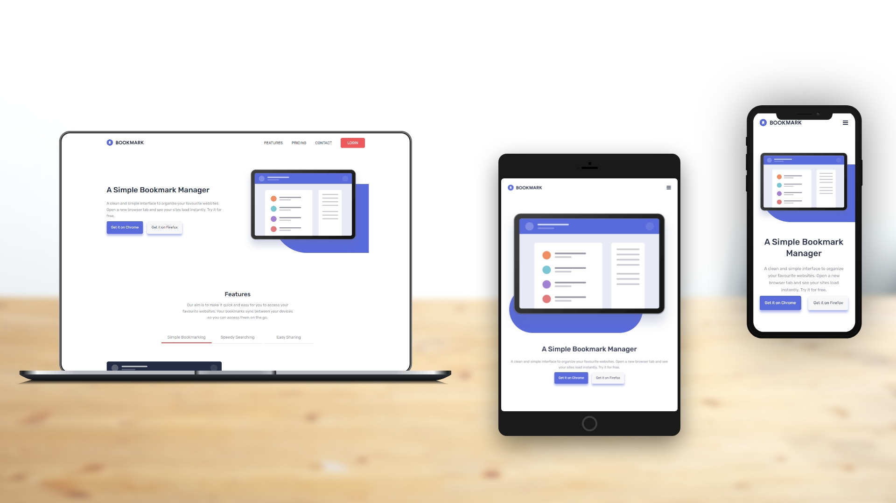

# Bookmark landing page

This is a solution to the [Bookmark landing page challenge on Frontend Mentor](https://www.frontendmentor.io/challenges/bookmark-landing-page-5d0b588a9edda32581d29158). Frontend Mentor challenges help you improve your coding skills by building realistic projects. 

## Table of contents

- [Bookmark landing page](#bookmark-landing-page)
  - [Table of contents](#table-of-contents)
  - [Overview](#overview)
    - [The challenge](#the-challenge)
    - [Screenshot](#screenshot)
    - [Links](#links)
  - [Front-end Style Guide](#front-end-style-guide)
    - [Layout](#layout)
    - [Colors](#colors)
    - [Typography](#typography)
    - [Fonts](#fonts)
  - [My process](#my-process)
    - [Built with](#built-with)
  - [Author](#author)

## Overview

### The challenge

Users should be able to:

- View the optimal layout for the site depending on their device's screen size
- See hover states for all interactive elements on the page
- Receive an error message when the newsletter form is submitted if:
  - The input field is empty
  - The email address is not formatted correctly

### Screenshot

### Links

- Live Site URL: [https://benjaminvillatte.github.io/fem-bookmark-landing-page/](https://benjaminvillatte.github.io/fem-bookmark-landing-page/)

## Front-end Style Guide

### Layout

The designs were created to the following widths:

- Mobile: 375px
- Desktop: 1440px

### Colors

_Primary_

- Soft Blue: hsl(231, 69%, 60%)
- Soft Red: hsl(0, 94%, 66%)

_Neutral_

- Grayish Blue: hsl(229, 8%, 60%)
- Very Dark Blue: hsl(229, 31%, 21%)

### Typography

- Font size: 18px

### Fonts

- Family: [Rubik](https://fonts.google.com/specimen/Rubik)
- Weights: 400, 500

## My process

### Built with

- Semantic HTML5 markup
- CSS custom properties
- Flexbox
- CSS Grid
- Mobile-first workflow
- Web components

## Author

- Website - [Benjamin VILLATTE](https://benjaminvillatte.fr)

